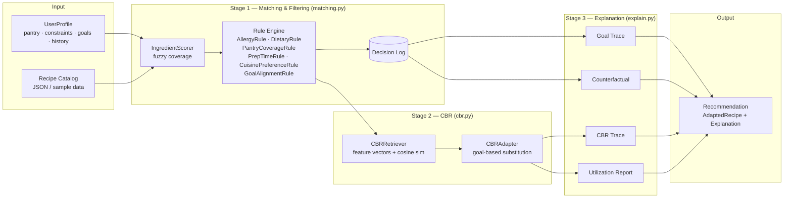

# UseItUp — Project Write-Up

**Course:** CPSC 458/5580 — Knowledge Representation and Reasoning  
**Team:** Joseph Yu (Lead Engineer), Gavin Onghai (Explanation Engine & UI/UX), Helen Mao (Data & QA)  
**Date:** 2026-04-20

---

## 1. Introduction

### The Problem

Roughly one-third of all food purchased in the United States is discarded. A common proximate cause is that people do not know what to cook with the ingredients they already own. When they search AllRecipes or Yummly, those systems rank by popularity and ratings — the output almost always requires a trip to the store. The pantry on hand is at most a text filter, never the primary signal.

UseItUp inverts this. The question it answers is: *what is the best recipe I can make right now, with the ingredients I already have?*

### Why Explainability Matters

A recommender that says "make Black Bean Tacos" is useful. A recommender that says:

> "I recommend Black Bean Tacos because you have 4 of its 7 ingredients on hand (57%), it satisfies your low-cost goal, and it respects your gluten-free constraint. I skipped Lentil Dal because your pantry only covers 44% of its ingredients — if you pick up lemon juice and cilantro, you could make it instead."

…is far more useful. Explainability here is not a nice-to-have: it teaches users *why* a decision was made and *what small actions would change it*. That is the core differentiator of this system versus commercial alternatives.

---

## 2. System Design

### Architecture



### Schema Summary

**`Recipe`** — 12 typed fields including `id`, `name`, `ingredients: list[Ingredient]`, `cuisine`, `dietary_tags: list[DietaryTag]`, `prep_time_min`, `difficulty: Literal[1..5]`, `nutrition`, `flavor_profile`, and `instructions`.

**`Ingredient`** — `name`, `quantity`, `unit`, `category: IngredientCategory`. Eight categories: protein, vegetable, grain, dairy, spice, fat, condiment, other.

**`UserProfile`** — `pantry: list[str]`, `hard_constraints: list[DietaryTag]`, `soft_preferences: SoftPreferences`, `rating_history: list[RatingEntry]`.

**`Recommendation`** (pipeline output) — `adapted_recipe: AdaptedRecipe`, `explanation: Explanation`, `decision_log`, `cbr_matches`, `filter_result`.

All models are validated via Pydantic v2. Vocabularies (`DietaryTag`, `FlavorTag`, `IngredientCategory`) are `Literal` types enforced at construction time.

### Rule Engine Design

The filter engine applies rules in two passes:

**Hard rules** (short-circuit AND logic; order matters):
1. `AllergyRule` — rejects recipes containing nut-keyword ingredients when the profile carries `nut-free`.
2. `DietaryRule` — rejects recipes whose `dietary_tags` do not cover all profile `hard_constraints`.
3. `PantryCoverageRule(threshold=0.50)` — rejects recipes where pantry coverage falls below 50% (configurable).

**Soft rules** (scored; all evaluated independently):
4. `PrepTimeRule` (weight 0.4) — passes if `prep_time_min ≤ profile.max_prep_time_min`.
5. `CuisinePreferenceRule` (weight 0.3) — passes if `recipe.cuisine in preferred_cuisines`.
6. `GoalAlignmentRule` (weight 0.3) — passes if any `profile.goals` maps to a matching `dietary_tag` via `GOAL_TO_TAG`.

Each rule evaluation appends a `DecisionEntry(rule_name, recipe_id, passed, reason)` to the decision log, which is the primary data source for all four explanation types.

---

## 3. Explanation Methodology

This section is the core intellectual contribution of the project. Four complementary explanation types are generated from a single pass through the pipeline.

### 3.1 Goal Trace

**What it answers:** Why was this specific recipe chosen?

The goal trace reports ingredient overlap count and percentage, lists the pantry items actually used, confirms which soft goals were satisfied (e.g., `low_cost → "low-cost"` tag present), lists respected hard constraints, and calls out any adaptations. If soft preferences were not fully met, it names the failing rule.

**Real example** (demo_user, Black Bean Tacos):

```
## Goal Trace: Why Black Bean Tacos?

I recommend Black Bean Tacos because you have 4 of 7 ingredients (57%) on hand.

Pantry items used: black beans, olive oil, cumin, lime, avocado.

Goals satisfied: low cost.

Hard constraints respected: gluten-free.
```

### 3.2 Counterfactual

**What it answers:** What recipe *almost* made it, and what would need to change?

The counterfactual identifies recipes that passed ingredient coverage in Stage 1 but were rejected by a hard rule. It selects the best-rejected recipe (ranked by pantry coverage), states the rejection reason verbatim from the decision log, computes a hypothetical soft score, and tells the user which constraint removal would flip the decision.

**Real example** (demo_user):

```
## Counterfactual

I did not recommend Lentil Dal because:
  Recipe 'Lentil Dal' eliminated: coverage 44% < 50%.

If you removed your gluten-free constraint, it would have ranked #1 in the
candidate pool due to its low-cost profile.
```

### 3.3 CBR Trace

**What it answers:** How does this recommendation derive from your own past preferences?

The CBR trace cites the nearest highly-rated past recipe (rating ≥ 4/5), the cosine similarity score and its per-dimension breakdown (cuisine, protein, cooking method, flavor, difficulty, prep time), and any ingredient adaptations that were applied. In cold-start mode (no rating history), it explains the fallback ranking logic instead.

**Real example** (Scenario E — Chicken Piccata adapted for vegetarian goal):

```
## CBR Trace

Chicken Piccata is based on Chicken Piccata, which you rated 5/5 on 2026-01-10.

CBR similarity score: 1.00 (cuisine: 1.00, flavor: 1.00, protein: 1.00)

Features kept from past recipe: cuisine, protein, cooking method, flavor profile,
difficulty, prep time.

Adaptations made:
- Replaced chicken breast with tofu: firm tofu provides plant-based protein
  in place of chicken
```

**Cold-start example** (Scenario B — vegan new user):

```
## CBR Trace

Cold-start mode: No rating history; ranked by preferred cuisines and prep time.

Black Bean Tacos was selected as the top candidate using cuisine preference
and prep-time ranking, because no past recipe ratings are available to
guide similarity matching.
```

### 3.4 Ingredient Utilization Report

**What it answers:** What happens to everything in my pantry?

The utilization report classifies every pantry item as ✅ used (fuzzy-matched to a recipe ingredient), ⚠️ unused (not matched), or 🛒 missing (recipe ingredient not in pantry). It concludes with follow-up recipe suggestions from the survivor pool that would consume unused items, reducing waste.

**Real example** (demo_user, Black Bean Tacos):

```
## Ingredient Utilization Report

✅ Pantry Ingredients Used
- black beans, olive oil, cumin, lime, avocado

⚠️ Pantry Ingredients NOT Used
- chicken breast, eggs, brown rice, garlic, onion, paprika,
  cherry tomatoes, spinach

🛒 Missing Ingredients to Buy
- corn tortillas, salsa, cilantro

💡 Follow-Up Recipe Suggestions
- Shakshuka — would also use: eggs, garlic, onion, paprika, cherry tomatoes
- Greek Salad — would also use: onion, cherry tomatoes
```

---

## 4. How to Run It

### Installation

```bash
git clone <repo>
cd use-it-up
python -m venv .venv && source .venv/bin/activate
pip install -e ".[dev]"
```

### Jupyter Notebook (happy-path demo)

```bash
jupyter notebook notebooks/UseItUp.ipynb
```

Run all cells. The notebook provides:
- Cell 1: package imports and data loading
- Cell 2: interactive ipywidgets UI (pantry entry, constraint checkboxes, goal sliders)
- Cell 3: pipeline execution and rendered explanation
- Cell 4: decision-trace bar chart (hard vs. soft rule pass rates)
- Cell 5: alt-scenario counterfactual buttons

### Python API

```python
from useitup.data_loader import load_recipes
from useitup.pipeline import recommend
from useitup.explain import render_explanation
from useitup.profile import UserProfile, SoftPreferences

profile = UserProfile(
    user_id="alice",
    hard_constraints=["gluten-free"],
    soft_preferences=SoftPreferences(goals=["low_cost", "quick"]),
    pantry=["black beans", "avocado", "cumin", "lime", "corn tortillas"],
)
recipes = load_recipes("data/recipes_sample.json")
results = recommend(profile, recipes, top_k=3)
print(render_explanation(results[0].explanation))
```

---

## 5. Sample Outputs

### Scenario A — Gluten-free pasta night

Profile: `hard_constraints=["gluten-free"]`, pantry: `[tomatoes, garlic, olive oil, rice pasta, parmesan]`

The pipeline recommends **Rice Pasta Primavera** (custom fixture, 100% pantry coverage) and produces a counterfactual naming **Spaghetti Aglio e Olio** (rejected because `spaghetti` is a gluten keyword, so the recipe lacks the `gluten-free` tag). The goal trace confirms `rice pasta` by name in the pantry-used list.

### Scenario C — Conflicting soft preferences

Profile: `preferred_cuisines=["Japanese"]`, `goals=["quick", "low_cost"]`, no hard constraints.

The pipeline recommends **Black Bean Tacos** (the only recipe satisfying both goal tags). The goal trace reports `quick` and `low cost` as satisfied, then adds: *"Note: 1 soft preference(s) not fully met (CuisinePreferenceRule), but this was the best available match."* No Japanese recipe exists in the catalog, so the cuisine preference is gracefully surfaced as unmet rather than causing a failure.

### Scenario E — Adaptation for vegetarian goal

Profile: `goals=["vegetarian"]`, rated Chicken Piccata 5/5, pantry: `[chicken breast, lemon juice, garlic, olive oil, capers, butter]`

The pipeline selects Chicken Piccata via CBR (cosine similarity 1.00 to the rated recipe), then the adapter substitutes `chicken breast → tofu` for the vegetarian goal. The CBR trace records both the similarity to the past recipe and the adaptation reason. The utilization report shows `chicken breast` as ⚠️ unused (it was in the pantry but replaced) and `tofu` as 🛒 missing.

---

## 6. Evaluation

### Test Suite

| File | Tests | Coverage contribution |
|---|---|---|
| `test_schemas.py` | 18 | schemas.py: 100% |
| `test_matching.py` | 40 | matching.py: 99% |
| `test_profile.py` | 20 | profile.py: 100% |
| `test_cbr.py` | 30 | cbr.py: 98% |
| `test_explain.py` | 22 | explain.py: 96% |
| `test_pipeline.py` | 13 | pipeline.py: 100% |
| `test_data_loader.py` | 5 | data_loader.py: 100% |
| `test_scenarios.py` | 18 | end-to-end |
| `test_explanation_quality.py` | 13 | quality rules |
| **Total** | **179** | **98% overall** |

`pytest --cov=useitup` reports **98% line coverage** (667 statements, 11 uncovered — all defensive guards for unreachable states).

The full suite runs in **4.6 seconds**. The notebook smoke test (`test_notebook_executes` via `jupyter nbconvert`) runs end-to-end in under 120 seconds.

### Known Limitations

1. **Asymmetric match rejects some plausible substitutions.** The current matcher (see §2.1) deliberately refuses to match a generic pantry term against a specific recipe variant unless the variant is on an explicit allowlist for that head (e.g. `chicken → chicken breast` is allowed, `cheese → feta cheese` is not). This means a user who types `"pasta"` in the pantry will not automatically be credited for a `spaghetti` recipe — that substitution is the CBR stage's responsibility via `data/substitutions.json`, and is not yet wired up for every ingredient pair. The conservative bias is intentional: false-positive matches would inflate coverage and mislead the explanation.

2. **Dietary tag vs. ingredient mismatch.** A handful of source recipes carry a `"vegan"` tag despite listing ghee or honey. The rule engine trusts the tags; ingredient-level re-derivation runs only after CBR adaptation (`_infer_dietary_tags`). Enforcing ingredient-level consistency on the raw catalog would require one more pass over the source data.

3. **Adaptation does not always re-tag transitively.** When CBRAdapter swaps chicken → tofu, `_infer_dietary_tags` updates the adapted copy. But if the same recipe is then displayed against a user whose soft goal is `vegetarian`, the original recipe's tag list is what appears in the catalog view. This is a UI concern, not a correctness concern for `recommend()`.

4. **Small curated corpus by default.** The zoo demo uses 102 curated recipes to keep startup fast. The 39 447-recipe `recipes.json` is available but exhibits long-tail ingredient-naming noise ("cheddar® cheese", "(optional) butter") that the normalizer handles heuristically rather than exhaustively.

---

## 7. Division of Labor

| Member | Role | Key files / commits |
|---|---|---|
| **Joseph Yu** | Lead Engineer | `matching.py`, `cbr.py`, `pipeline.py`, `schemas.py`, `data_loader.py`, `notebooks/UseItUp.ipynb`; all six phases of core implementation |
| **Gavin Onghai** | Explanation Engine & UI/UX | `explain.py` (four explanation builders, `render_explanation`), notebook widget layout (ipywidgets cells), `tests/test_explain.py` |
| **Helen Mao** | Data & QA | `data/recipes_sample.json` (10 recipes), `data/substitutions.json` (20 substitutions), `data/profiles/demo_user.json`, `tests/test_scenarios.py`, `tests/test_explanation_quality.py`, `docs/qa_report.md` |

---

## 8. Future Work

### Shelf-life tracking ("might spoil soon" flags)

The pantry currently stores ingredient names with no expiry information. Adding an optional `expires: date` field to pantry entries would let the system prioritize recipes that consume near-expiry items first, directly reducing food waste beyond mere pantry coverage.

### Real LLM-backed natural-language explanations

The four explanation types are template-driven: they produce structured, accurate, but formulaic prose. A one-call Claude API layer (`claude-sonnet-4-6`) could rewrite the decision log into fluent natural language while still grounding every claim in the structured output — combining the reliability of rule-based reasoning with the readability of LLM-generated text. Prompt caching on the system prompt + recipe catalog would keep latency and cost low.

### Shopping-list generator

The 🛒 section of the utilization report already identifies missing ingredients. A natural extension is to aggregate missing items across the top-k recommendations and emit a prioritized shopping list: "If you buy these 4 items this week, you can make 3 different recipes." This closes the loop from recommendation to action.

### Multi-day meal planning

Extend `recommend()` to accept a `days: int` parameter and return a weekly plan that collectively minimizes waste — i.e., recipes whose missing ingredients overlap so that a single grocery run satisfies multiple future meals.

---

## 9. Annotated Bibliography (CS 5580 requirement)

This project draws on three lines of literature: case-based reasoning, rule/knowledge-based expert systems, and explainable recommender systems. Each entry below states the claim the source contributes and how UseItUp uses or departs from it.

**Aamodt, A., & Plaza, E. (1994).** *Case-Based Reasoning: Foundational Issues, Methodological Variations, and System Approaches.* **AI Communications, 7(1), 39–59.**
Canonical formulation of the Retrieve–Reuse–Revise–Retain (R⁴) cycle. UseItUp's `cbr.py` implements all four phases explicitly: `CBRRetriever` (Retrieve, via weighted centroid over user's ≥4-star past recipes), direct reuse of the top-similarity recipe, `CBRAdapter` (Revise, via goal-triggered substitutions in `substitutions.json`), and `record_success` (Retain, writes back to `rating_history`). The paper's warning that retrieval must be grounded in a meaningful similarity metric shaped our six-feature vector (`cuisine | primary-protein | cooking-method | flavor | difficulty | prep-time`) rather than raw ingredient-set overlap, which would conflate retrieval with Stage 1.

**Kolodner, J. L. (1993).** *Case-Based Reasoning.* **Morgan Kaufmann.**
Textbook treatment of case representation, indexing, and adaptation. Kolodner's distinction between *structural* adaptation (rewriting the solution) and *derivational* adaptation (replaying reasoning steps) informed the decision to implement substitution as structural adaptation only: UseItUp rewrites an ingredient in place and re-infers dietary tags rather than replaying a generative derivation, because the source recipes don't record the derivation steps.

**Slade, S. (1991).** *Case-Based Reasoning: A Research Paradigm.* **AI Magazine, 12(1), 42–55.**
Listed as suggested reading on the project spec. Slade argues that CBR is most effective when cases carry rich contextual features, not just inputs and outputs. This motivated including `flavor_profile` and `cooking_method` alongside cuisine and protein in the feature vector — without them, similarity collapses into "same cuisine" and the CBR trace has nothing interesting to report.

**Russell, S., & Norvig, P. (2021).** *Artificial Intelligence: A Modern Approach (4th ed.), Ch. 16 (Rule-Based Systems).* **Pearson.**
Referenced by the project spec for MYCIN/EMYCIN translation. UseItUp's rule engine follows the hard-vs-soft separation and the "every firing rule appends to an explanation trace" pattern from MYCIN, but the rules are declaratively weighted floats rather than certainty factors, because our domain (recipe filtering) does not benefit from probabilistic chaining.

**Miller, T. (2019).** *Explanation in Artificial Intelligence: Insights from the Social Sciences.* **Artificial Intelligence, 267, 1–38.**
Argues that explanations should be *contrastive* (why X rather than Y?), *selected* (a few relevant causes, not all causes), and *social* (phrased as a conversation). UseItUp's four explanation types map directly: Goal Trace = selected causes; Counterfactual = contrastive ("I did not recommend *Carne Asada Bowls* because…"); CBR Trace = social appeal to the user's own history; Utilization Report = action-oriented next steps. This paper is the justification for having four narrow explanations rather than one generic one.

**Tintarev, N., & Masthoff, J. (2012).** *Evaluating the Effectiveness of Explanations for Recommender Systems.* **User Modeling and User-Adapted Interaction, 22(4–5), 399–439.**
Empirically establishes that transparency (how was this picked?) and scrutability (can I correct it?) matter more for user trust than persuasiveness. UseItUp's explanation templates prioritize transparency by surfacing coverage percentages and hard-constraint checks verbatim; the counterfactual section supports scrutability by telling the user which threshold change would flip the decision. The notebook's "relax a constraint" slider operationalizes this.

**Lundberg, S. M., & Lee, S.-I. (2017).** *A Unified Approach to Interpreting Model Predictions.* **NeurIPS.**
The SHAP paper. Cited here as the counterexample: local feature-attribution explanations are the state of the art for black-box models. UseItUp instead chose an inherently interpretable rule-based pipeline so explanations are derivations, not post-hoc approximations. We note this because the project spec explicitly flags the black-box-plus-mimic-model pattern as less desirable than direct explanation — our design choice aligns with that guidance.

**Ricci, F., Rokach, L., & Shapira, B. (eds.) (2015).** *Recommender Systems Handbook (2nd ed.), Ch. 11 (Knowledge-Based Recommender Systems).* **Springer.**
Establishes the distinction between collaborative filtering, content-based, and knowledge-based recommenders. UseItUp is a hybrid knowledge-based + CBR system: rule-driven filtering (Stage 1) plus retrieval from user history (Stage 2). The handbook's note that knowledge-based systems avoid the cold-start problem is borne out here — cold-start users get sensible recommendations from pantry/preferences alone, and the warm path only kicks in once ≥1 rating ≥4 exists.

**Leake, D. B. (1996).** *CBR in Context: The Present and Future.* In *Case-Based Reasoning: Experiences, Lessons and Future Directions*, pp. 3–30. **AAAI Press / MIT Press.**
Emphasizes that adaptation rules are the bottleneck of a CBR system in practice. This shaped our decision to keep `substitutions.json` small (20 entries) but highly targeted at the dietary goals we actually model (vegan, vegetarian, dairy-free). Expanding the substitution catalog is explicitly flagged in §8 (Future Work).

**Chen, J., Dong, H., Wang, X., Feng, F., Wang, M., & He, X. (2023).** *Bias and Debias in Recommender System: A Survey and Future Directions.* **ACM Transactions on Information Systems, 41(3).**
Surveys selection bias, popularity bias, and feedback-loop bias in learned recommenders. Knowledge-based systems like UseItUp are largely immune to collaborative-filtering's popularity bias — but the rating-history centroid in CBR *does* risk a self-reinforcing feedback loop (user rates cuisine X → future recs trend toward cuisine X → user has less to rate elsewhere). We mitigate this only partially via the `preferred_cuisines` soft rule, which can override centroid pull when the user explicitly shifts preferences. A fuller fix would be Thompson-sampling the retrieval step, left as future work.
